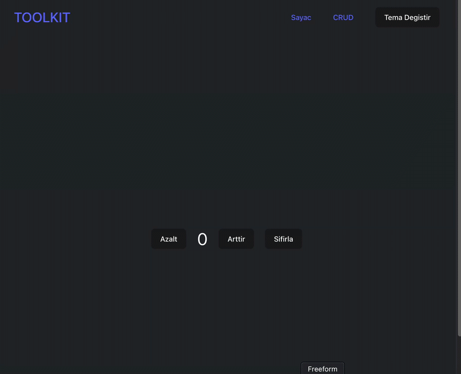

<h1>REDUX TOOLKIT</h1>

- REDUX TOOLKIT

Compared to classic Redux, we can achieve the same result with less code.
The toolkit includes the Thunk package by default.
With the DevTools extension, we can monitor the store, reducers, and dispatched actions during project development.
Managing the state within the project becomes easier.

- SETUP

Install Redux Toolkit: npm i @reduxjs/toolkit
Install React Redux: npm i react-redux
Create the store and reducers.

- SLICE

In Redux Toolkit, a slice is a construct that allows us to define both reducers and actions in a single location.

<h2>Screenshot</h2>

